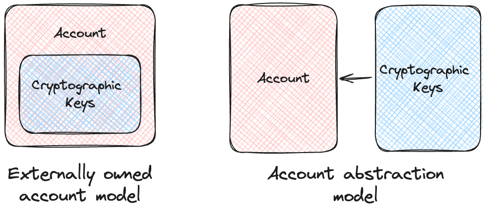

# What is Account Abstraction?
Account Abstraction refers to the development of blockchain technology for higher flexibility, ease of use, and security when dealing with accounts on a blockchain. Normally, most blockchain networks, such as Ethereum, are designed based on two primary kinds of accounts.

The first is the Externally Owned Accounts(EOA) controlled by private keys, whereas the second includes those Contract Accounts controlled by the smart contract code. Account abstraction further blurs these lines by allowing richer logic and features at the level of an account, thus allowing the customization of account behavior beyond the rigid structure imposed by EOAs and CAs.

## How does Account Abstraction work?
Account abstraction changes how the blockchain validates transactions. Instead of relying on the default EOA structure, AA enables smart contracts to act as accounts. Smart contract accounts can define custom validation logic for transactions, including mechanisms such as signature verification, multi-signature schemes, rate-limiting of transactions, and recovery in case of lost keys. This makes accounts programmable and much more versatile by letting smart contracts directly control account logic.

## Key EIPs and Standards for Account Abstraction?
Several EIPs and standards are proposed for implementing and fine-tuning account abstraction, including but not limited to:

### EIP-86
In 2017, EIP-86 was among the very first attempts at account abstraction. It wanted to make the validation of a transaction programmable. It allowed the functionality of smart contracts to be extended as if they themselves were accounts. The implementation was postponed due to certain complexities and risks.

### EIP-2938
Following EIP-86, EIP-2938 introduced “User Operations,” whereby the user may delegate to a “Paymaster” smart contract the job of paying for the gas of his transactions. This made explicit the distinction between user operations and regular transactions.

### ERC-4337
ERC-4337 is the most practical and widely adopted implementation of account abstraction. ERC-4337 realizes AA without changing the consensus layer of Ethereum. Instead, it relies on a higher-layer infrastructure comprising encapsulated user actions (“User Operations”), bundlers that package the operations, and Paymaster smart contracts that sponsor the gas fees. This allows for further use cases such as gasless transactions, customizable account recovery, and smart contract wallets. Read about it in detail here.

## Advantages of Account Abstraction
Account abstraction brings numerous benefits to blockchain systems. Firstly, it brings a better user experience: gasless transactions are possible since third-party paymasters pay for the gas; wallet management gets easier with social recovery and key rotation. Secondly, it enhances security through multi-signature wallets and time-locked transactions that reduce reliance on single private keys. It also introduces more flexibility by allowing custom signature schemes, including those based on biometrics or password authentication, and supports the most advanced cryptographic primitives. Last but not least, it increases interoperability through unified account architectures and cross-chain interactions.

## Use Cases of Account Abstraction
Smart Contract Wallets
Smart contract wallets, such as Argent and Safe (previously Gnosis Safe), have implemented account abstraction. These wallets provide a set of interesting features, including social recovery, the ability of users to recover accounts with the help of trusted contacts—and custom spending limits with policies for approving transactions. Looking to build on Gnosis, here is an article on Hackathon Essentials to get you started the right way and the fast way.

### Gasless Transactions
This makes onboarding much easier for new users with gasless transactions because they do not need to purchase any native tokens to pay the transaction fees. In such cases, Paymasters cover these fees, usually funded by dApps or third-party applications.

### Programmable Payments
Account Abstraction enables the automation of a variety of open-ended payment schemes, subscription-based payments, mechanisms of escrow for conditional payouts, and payroll systems with dynamic distribution logic by an enterprise. These all extend convenience and functionality to the payment systems.

### Identity and Authentication
AA can be very instrumental in developing decentralized identity solutions. It enables features like passwordless login, multi-factor authentication, and integration with decentralized identity standards such as Decentralized Identifiers (DIDs), all in a robust framework that ensures secure authentication and efficient identity management.

### Defi Innovations
Account abstraction enhances Decentralized Finance platforms in presenting pre-approved transaction conditions and automated asset management. These features will enhance the security and efficiency of DeFi operations.

## Ecosystems Using Account Abstraction
A number of blockchain ecosystems are now actively implementing account abstraction in order to improve user experience and functionality.

Ethereum is leading the way in this regard, especially with standards such as ERC-4337. Wallet providers like Argent and a number of dApps in the Ethereum ecosystem have already integrated AA features. Polygon has also implemented account abstraction to improve scalability and usability, offering developers lower fees and faster transactions. Because it natively supports smart contract wallets, Starknet a Layer2 scaling solution for Ethereum reduces user friction. Optimism introduces account abstraction in order to provide more gas-efficient solutions that are even friendlier to dApps using the chain. ZkSync uses zero-knowledge proofs in an AA combination to offer secure, low-cost yet extremely user-centric blockchain solutions.

## Potential Ideas to Build Using Account Abstraction
With account abstraction, the possibilities for innovation are huge. Developers can create universal wallets that seamlessly operate across blockchains, from gasless transactions and social recovery to biometric authentication. Programmable accounts could let decentralized applications for subscription-based services handle the automated creation and payment of recurring invoices. Decentralized identity platforms would also be able to leverage AA to provide secure authentication and key management.

Another promising avenue is customizable escrow services that secure peer-to-peer and business-to-business exchanges. The gaming applications will also be integrating AA to handle in-game assets or the interoperability of different games or seamless onboarding. In the last instance, DeFi shall be reshaped with risk management tools, boasting advanced account-based controls via transaction whitelisting, rate limits, and portfolio tracking.

Looking ahead, standardization efforts like the furtherance of ERC-4337 will ultimately drive interoperability and adoption. Better integrations of account abstraction within Layer-2 solutions will bring scalability and greater ease of access. Besides, this will be of huge importance in the development of strong tools and resources for developers that will power up the ecosystem.

## Conclusion
Account abstraction has the potential to revolutionize blockchain usability, security, and flexibility. Allowing programmable accounts removes the traditional constraints of blockchain architecture and opens a whole new world of possibilities for developers and users. As standards like ERC-4337 mature and more use cases get built around them, one can expect account abstraction to be one of the main backbones of the decentralized web powering innovative applications in many industries.