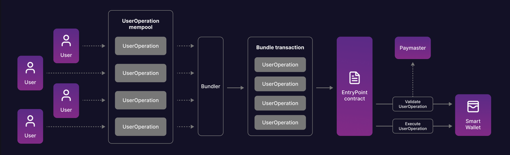

# What is Account Abstraction? ERC-4337 Explained

Web3 wallets are a user's key to the blockchain — but the user experience for most wallets today isn't great, and it poses one of the greatest obstacles to mass adoption.

For a new user to interact with the blockchain, they must: create a wallet, store their private keys, purchase & transfer funds, pay gas fees, and sign every single action that they take on a dApp. With such an intimidating user experience for newcomers, something must change.

Enter ERC-4337: a new ‘account abstraction’ standard that unlocks the power of smart contract wallets, or ‘smart accounts,’ on the Ethereum blockchain (and EVM-compatible networks). ERC-4337 is one of the biggest upgrades to the way web3 wallets work, creating an infinitely-smoother experience for users, regardless of web3 knowledge, through smart accounts.

In today's lesson, we’re going to demystify everything you need to know about account abstraction and ERC-4337. We’ll cover what account abstraction is, how it works, why ERC-4337 is a major upgrade for the web3 wallet user experience, and how to implement ‘smart accounts’ into your web3 apps. Let's dive in.

## What is account abstraction (ERC-4337)?
Account abstraction (ERC-4337) is an Ethereum update that lets you create non-custodial wallets as programmable smart contracts.

It unlocks many possibilities, such as easy wallet recovery, signless transactions, and team wallets. This makes the web3 experience safer, faster, and more flexible.

Smart contract wallets set up using account abstraction have multiple names like smart accounts, smart wallets, and account abstracted wallets. To avoid any confusion in this lesson, we will only refer to them as smart accounts.

Before we dive deeper into account abstraction and what makes it so revolutionary for web3, we need to understand “Ethereum accounts” and how they work.

## Get started with Account Abstraction
### What are Ethereum accounts?
An Ethereum account is a unique digital address on the Ethereum blockchain that stores ether (ETH) and can initiate and/or execute transactions. There are two types of Ethereum accounts:

Externally-owned accounts (EOAs)
Contract accounts
Externally-owned accounts (EOAs)
Externally-owned accounts are wallets owned (by users) and operated manually from outside the blockchain ecosystem. They are managed using a public-private key pair and whoever owns the private key can use the assets stored in the EOA.

The most crucial part of an EOA is its seed phrase — a string of 12, 18, or 24 random words generated when you’re setting up your wallet. The EOA uses the seed phrase to generate the private key, which you then use to sign transactions.

Hence, account owners must store their seed phrase offline to secure it against hacks and thefts. If they lose their private key, the seed phrase is the only way to re-generate the private key and gain access to the assets.

💡
Most of today's popular crypto wallets are EOAs, such as Coinbase Wallet and MetaMask.
EOAs are a crucial part of the Ethereum ecosystem. By design, the Ethereum network can only go through a state transition when an EOA triggers a transaction and pays the gas fees in ETH.

But they are limited in terms of features and flexibility. **They can only perform two actions:**

Transfer tokens to other EOAs
Initiate transactions that trigger another smart contract transaction.
These design limitations present many challenges:

1. Poor security: An EOA’s entire security is linked to one seed phrase. If you lose your private key and seed phrase, you may lose all your assets. And there are no social recovery options. Besides, you can’t set spend limits, 2FAs, etc. for security.

2. Lack of customization: Transactions from EOAs cannot be customized or automated. Owners must manually sign every transaction.

3. Gas payment: EOA owners must own ETH at all times to pay gas for transactions. They can not use any other token.

4. Poor overall UX: All of the above make for a poor user experience which is not suited for most new users.

So, while EOAs have brought us a long way in the web3 journey, they aren’t the way to blockchain mass adoption. New users need a simpler UI, better security, and more flexibility.

**That’s where contract accounts and account abstraction come in.**

Build free web3 apps 
Contract Accounts
Contract accounts are smart contracts functioning as a crypto wallet. It is possible to code various logic into the smart contracts to customize transactions and add other features to contract accounts.

However, contract accounts don’t have a private key or seed phrase and they cannot initiate a transaction. They can only execute a certain action when a transaction from an EOA triggers the smart contract code.

That means users need to maintain an EOA with an ETH balance to operate a contract account. This makes contract account operation even more inconvenient than operating a standalone EOA.

Account abstraction changes this. Let’s see how.

💡

## How does account abstraction work?
The most important innovation of account abstraction and ERC-4337 is not contract-based wallets: it’s the ability to abstract (separate) the need for separate EOAs or contract accounts.

Account abstraction enables the creation of smart accounts, which are independent smart contracts that can initiate and execute transactions without the need for an EOA. Any custom operation that can be defined in the form of smart contract code can be implemented in smart accounts.

The operation of smart accounts, or account abstracted wallets, is fairly simple. Instead of sending regular transactions as EOAs do, smart accounts use objects called UserOperations, which represent an operation that is to be conducted on behalf of the user.

The UserOperation object has multiple data elements that describe the type of transaction, the token, limit≤ and price for gas at various steps of the transaction, the signature to validate the transaction, and other metadata.

Every time a smart account sends a UserOperation, it goes into the common waiting area for all UserOperations called the alt mempool.

These requests are then bundled by bundlers, who are similar to nodes verifying regular transactions. They even use the same logic as mining or validator nodes to prioritize transactions where they can extract the most value.

The bundled UserOperations are sent through a single whitelisted “Entry Point,” where every individual UserOperation is verified and executed by calling different functions.

## How transactions work in Ethereum smart accounts?
As UserOperations can include any type of logic, it allows users to implement various customizations to how they want to manage their accounts and the funds in them.

## Start building with ERC-4337
4 Example Use Cases for Account Abstraction
Account abstraction is a fairly new update to Ethereum and developers are still exploring the vast possibilities that it can bring to web3. Here are some of the best use cases account abstraction unlocks:

1. Wallet recovery
Unlike EOAs, a smart account’s security does not rely on a seed phrase or private key.

A smart account owner can assign multiple devices, people, or third-party services as wallet guardians. In case they lose their credentials, the guardians can sign a transaction to assign new credentials to access the smart account.

This does not compromise the user’s control or ownership of the assets.

2. Batch transactions
Making a simple swap from one token to another on a decentralized exchange requires two separate transactions. Firstly, the user needs to sign with their private keys to approve the dapp to use the token they want to swap. Then, they need to sign the transaction to execute the swap.

There are other more complex web3 transactions that need three or more approvals from the signer.

Using smart accounts, we can batch multiple transactions together and approve all of them at once. For the first time, this can make DeFi transactions feel as simple as traditional finance transactions.

3. Shared accounts & team wallets
With a single seed phrase controlling full access to an EOA, you can either share complete access to your crypto wallet with someone or not share it at all. There’s no in-between.

Account abstraction lets you share different levels of access to your wallet with multiple users. So, say, you can create a multi-signature where two or more users must sign a transaction to execute it. Further, you may add users that can only pay limited amounts to a specific set of wallets within specific durations.

4. Automated transactions
When using an EOA, you have to manually initiate or sign every transaction on a dapp. There’s no way to automate this process for transactions that you trust.

In the case of smart accounts, you can define a range of parameters such as access to specific tokens, spend limits, duration, gas limit, specific actions based on pre-defined triggers, and much more. The only limit is how far we can think.

## Some other benefits of account abstraction include:

Define custom security features such as daily spend limits.
Sponsor gas fees of transactions of other users.
Use any token to pay gas.
Build apps with account abstraction

### Q. How does account abstraction help developers?
Developers on EVM-compatible blockchains will be able to improve the overall user experience and attract more users to their platform. **Here are a few things developers can do:**

Offer wallets with easy recovery and no seed phrase.
Build intuitive wallet interfaces with customizable transactions.
Sponsor the gas fees for transactions such as airdrop claims or NFT mints.
Enable users to pay gas in tokens other than Ether (ETH).

### Q. Will account abstraction and ERC-4337 make Ethereum more scalable?
No. ERC-4337 only focuses on making web3 wallets more user-friendly. It doesn’t directly affect scalability or transaction speeds in any way.

### Q. How are abstracted accounts different from previously existing smart contact wallets?
Smart contract wallets needed an externally owned account (EOA) such as a MetaMask wallet to initiate transactions. Abstracted accounts can initiate transactions on their own. They are also easier for end users to create and customize while being more secure.

## Is account abstraction the future of Ethereum wallets?
Account abstraction (and ‘smart accounts') opens web3 applications and wallets to a wide range of new possibilities. With smart accounts, users will not only have an easier time managing wallets but also have the flexibility to optimize how they want their wallets to operate.

Eventually, almost every user will prefer a smart account over an EOA. And as a developer, this is the best time to start integrating smart accounts into your dApps. You can design better experiences for your users, such as instant non-custodial wallets, gas-free airdrop claims for users, easy account recovery, and so on.

There’s no arguing that smart accounts are the future of web3 interactions and they will set a new standard for what is possible in web3.

We hope this lesson has helped you better understand what account abstraction is, why ERC-4337 is such a major unlock for the web3 wallet experience, and some example use cases that you can implement into your dApps with account abstraction today.

 